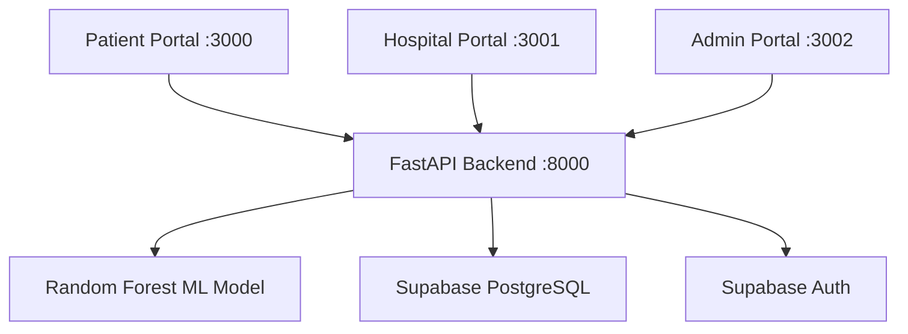

# 🏥 HealthAI — AI-Powered Full-Stack Healthcare Platform

HealthAI is a production-grade, AI-driven healthcare platform designed to bridge the gap between patients and medical professionals. By combining **Machine Learning (Random Forest)** with a robust **Next.js** frontend and **FastAPI** backend, HealthAI provides instant disease prediction based on symptom analysis, secure medical records management, and clinical decision support.

---

## 🚀 Key Features

### 👤 Patient Portal
- **AI Symptom Checker**: Instant disease prediction with confidence scoring.
- **Risk Assessment**: Color-coded risk levels (Low/Medium/High) with personalized recommendations.
- **Medical History**: Secure tracking of past diagnoses and symptom logs.
- **Premium UI**: Modern dark-mode interface with glassmorphism aesthetics.

### 🏥 Hospital Dashboard
- **Patient Management**: Centralized view of all patients and their AI-predicted records.
- **Clinical Notes**: Doctors can add private or shared observation notes.
- **Analytics**: Department-level insights and risk distribution charts.

### ⚙️ Admin Control Panel
- **Organization Management**: Create and manage hospital entities.
- **User Auditing**: Monitor system-wide access and activity logs.
- **Platform Metrics**: High-level overview of platform performance and model accuracy.

---

## 🛠️ Tech Stack

| Layer | Technologies |
| :--- | :--- |
| **Frontend** | Next.js 14, React 18, Tailwind CSS, Lucide, Recharts |
| **Backend** | FastAPI (Python 3.11), Uvicorn, Pydantic |
| **Machine Learning** | Scikit-learn (Random Forest), Joblib, Pandas, NumPy |
| **Database & Auth** | Supabase (PostgreSQL + Auth), Row Level Security (RLS) |
| **Deployment** | Vercel (Frontends), Render (Backend) |

---

## 📐 System Architecture

HealthAI utilizes a **Multi-Portal Architecture** to ensure security and role-specific workflows:



---

## 📂 Project Structure

```text
HealthAI/
├── apps/
│   ├── patient/       # Patient-facing Next.js application
│   ├── hospital/      # Clinical staff dashboard
│   └── admin/         # System administration panel
├── backend/           # FastAPI server & REST API logic
│   ├── routers/       # Role-based API endpoints
│   ├── models/        # Serialized ML model artifacts (.pkl)
│   └── schemas/       # Pydantic data validation models
├── ml/                # Data science & training scripts
│   ├── data/          # Symptom-Disease datasets
│   └── train_model.py # Random Forest training pipeline
└── START_HealthAI.bat # Automated local development launcher
```

---

## ⚙️ Local Development

### Prerequisites
- Node.js 18+
- Python 3.11+
- Git

### Quick Start
1. **Clone the repository**:
   ```bash
   git clone https://github.com/sarvesh-3112/HealthAI-FullStack-Healthcare-Platform.git
   cd HealthAI
   ```

2. **Launcher**:
   Run the included batch file to start all services (Backend + 3 Portals) simultaneously:
   ```bash
   ./START_HealthAI.bat
   ```

3. **Access**:
   - Patient: `http://localhost:3000`
   - Hospital: `http://localhost:3001`
   - Admin: `http://localhost:3002`

---

## 🌐 Deployment

- **Frontend**: The `apps/` directory is optimized for deployment on **Vercel**. Each portal should be deployed as a separate project pointing to its respective subdirectory.
- **Backend**: The `backend/` directory is designed for **Render** or **Railway**, supporting automated builds via the provided `requirements.txt`.

---

## ⚖️ License
Distributed under the MIT License. See `LICENSE` for more information.

---

Created with ❤️ by the HealthAI Team.
